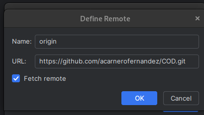

Para hacer esto solo hay que hacer unos simples pasos,
el primero es clonar el repositorio de github
segundo en pycharm seleccionamos el proyecto y le damos a GIT manage remotes
y por ultimo cambiamos el enlace de la carpeta en la que queramos que este nuestro poryecto 

] 
Paso de copiado

]
Segundo paso